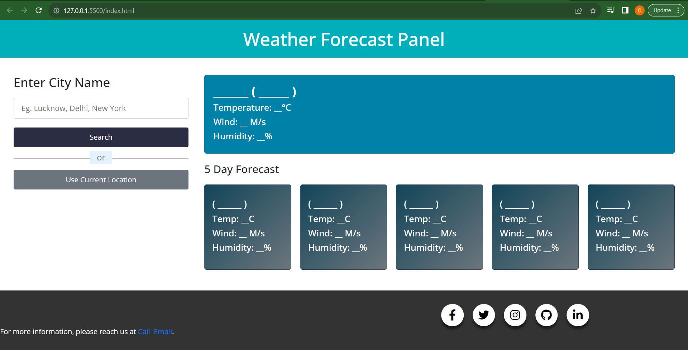

# Weather-App-using-API
Weather App

A simple web application that allows users to check the weather conditions for a specific city using the OpenWeatherMap API.
## Introduction

This project is a basic weather app built with HTML, CSS, and JavaScript. It fetches weather data from the OpenWeatherMap API based on the user's input (city name) and displays the current weather conditions, including temperature and weather description.

## Features

- Allows users to search for weather information by entering a city name.
- Displays the current temperature, weather conditions, and the city's name and country.
- Uses the OpenWeatherMap API to fetch weather data.
- User-friendly interface for checking weather conditions.
- Real-time weather data provided by the OpenWeatherMap API.
- Supports searching for weather information in different cities worldwide.

